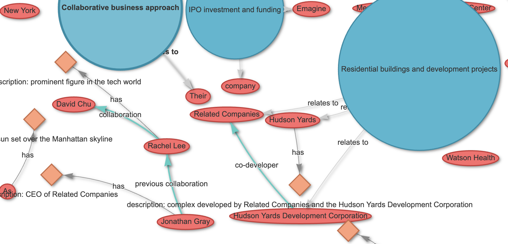

# MSG_NET - Entity Relationship Graph Visualizer

A comprehensive Rust application that converts text data (chat messages, documents, articles) into interactive network graphs using vis.js, visualizing entities, relationships, concepts, and their connections.



## Table of Contents

- [MSG\_NET - Entity Relationship Graph Visualizer](#msg_net---entity-relationship-graph-visualizer)
  - [Table of Contents](#table-of-contents)
  - [Features](#features)
    - [Core Functionality](#core-functionality)
    - [Advanced Capabilities](#advanced-capabilities)
  - [Installation](#installation)
    - [Prerequisites](#prerequisites)
    - [Build from Source](#build-from-source)
  - [Quick Start](#quick-start)
    - [1. Generate Example Data](#1-generate-example-data)
    - [2. Basic Usage](#2-basic-usage)
    - [3. View Results](#3-view-results)
  - [Detailed Usage](#detailed-usage)
    - [Command Line Interface](#command-line-interface)
      - [Generate Graph](#generate-graph)
      - [Comprehensive Help](#comprehensive-help)
      - [Analyze Text](#analyze-text)
      - [Generate Configuration](#generate-configuration)
      - [Show Examples](#show-examples)
  - [Configuration](#configuration)
    - [Sample Configuration](#sample-configuration)
    - [Configuration Sections](#configuration-sections)
      - [Node Appearance](#node-appearance)
      - [Layout Options](#layout-options)
      - [Physics Simulation](#physics-simulation)
      - [Extraction Settings](#extraction-settings)
  - [Output Formats](#output-formats)
    - [HTML (Interactive)](#html-interactive)
    - [JSON (Structured Data)](#json-structured-data)
    - [CSV (Tabular)](#csv-tabular)
    - [GraphML (XML)](#graphml-xml)
    - [DOT (Graphviz)](#dot-graphviz)
  - [AI Story Generation](#ai-story-generation)
    - [Prerequisites](#prerequisites-1)
    - [Features](#features-1)
    - [Usage Examples](#usage-examples)
      - [Basic AI Story Generation](#basic-ai-story-generation)
      - [Complete AI Workflow](#complete-ai-workflow)
    - [Benefits](#benefits)
  - [LLM Integration](#llm-integration)
    - [Setup Ollama](#setup-ollama)
    - [Usage with LLM](#usage-with-llm)
    - [Benefits of LLM Integration](#benefits-of-llm-integration)
    - [Deep Analysis Mode](#deep-analysis-mode)
  - [Interactive Graph Features](#interactive-graph-features)
    - [User Interface Layout](#user-interface-layout)
      - [Side Panel (Left)](#side-panel-left)
      - [Information Panel (Top-Right)](#information-panel-top-right)
    - [Navigation](#navigation)
    - [Node Interaction](#node-interaction)
    - [Layout Controls](#layout-controls)
    - [Filtering](#filtering)
  - [Architecture](#architecture)
    - [Module Structure](#module-structure)
    - [Key Components](#key-components)
      - [Text Processor](#text-processor)
      - [Entity Extractor](#entity-extractor)
      - [Graph Builder](#graph-builder)
      - [Export System](#export-system)
  - [Development](#development)
    - [Building](#building)
    - [Testing](#testing)
    - [Adding Features](#adding-features)
      - [New Export Format](#new-export-format)
      - [New Entity Type](#new-entity-type)
      - [New Layout Algorithm](#new-layout-algorithm)
  - [Contributing](#contributing)
    - [Code Style](#code-style)
    - [Testing Guidelines](#testing-guidelines)
    - [Documentation](#documentation)
  - [Troubleshooting](#troubleshooting)
    - [Getting Help](#getting-help)
      - [Comprehensive Usage Guide](#comprehensive-usage-guide)
      - [Standard Help](#standard-help)
    - [Common Issues](#common-issues)
      - [Compilation Errors](#compilation-errors)
      - [Large Input Files](#large-input-files)
      - [LLM Connection Issues](#llm-connection-issues)
      - [Export Failures](#export-failures)
    - [Performance Optimization](#performance-optimization)
      - [For Large Texts](#for-large-texts)
      - [For Complex Graphs](#for-complex-graphs)
  - [License](#license)
  - [Acknowledgments](#acknowledgments)
  - [Version History](#version-history)
  - [Roadmap](#roadmap)
    - [Planned Features](#planned-features)
    - [Performance Improvements](#performance-improvements)
    - [A Work In Progress](#a-work-in-progress)

## Features

### Core Functionality

- **Entity Extraction**: Automatically identifies people, places, organizations, events, products, and concepts
- **Relationship Detection**: Discovers connections between entities with confidence scoring
- **Concept Mapping**: Links related concepts and ideas found in the text
- **Interactive Visualization**: Web-based graphs with zoom, pan, and node selection
- **Multiple Export Formats**: HTML, JSON, CSV, GraphML, and DOT formats

### Advanced Capabilities

- **AI Story Generation**: Create custom entity-rich narratives using Ollama LLMs
- **Configurable Appearance**: Customizable node colors, shapes, and layout algorithms
- **Pattern-based Extraction**: Uses regex patterns for reliable entity detection
- **LLM Integration**: Optional support for Ollama/LLaMA models for enhanced extraction
- **Deep Analysis Mode**: Comprehensive relationship extraction with multi-phase processing
- **Professional UI**: Collapsible panels with Information Panel in top-right corner
- **Hierarchical Layouts**: Organized visualization of entity relationships
- **Metadata Preservation**: Maintains confidence scores and position information
- **Advanced Stopword Removal**: Built-in English stopwords with custom file support and optional disabling

## Installation

### Prerequisites

- Rust 1.70+ (install from [rustup.rs](https://rustup.rs/))
- Optional: Ollama for LLM-enhanced extraction

### Build from Source

```bash
git clone <repository-url>
cd msg_net
cargo build --release
```

## Quick Start

### 1. Generate Example Data

```bash
# Create sample text for testing
cargo run -- example --generate-text -o sample.txt

# Generate AI story with custom word count (requires Ollama)
cargo run -- example --generate-ai-story --word-count 300 -o ai_story.txt

# Create sample configuration
cargo run -- config -o my_config.json
```

### 2. Basic Usage

```bash
# Generate an interactive HTML graph
cargo run -- generate -i sample.txt -o graph.html

# Analyze text without generating output
cargo run -- analyze -i sample.txt --verbose
```

### 3. View Results

Open `graph.html` in your web browser to explore the interactive graph.

## Detailed Usage

### Command Line Interface

#### Generate Graph

```bash
cargo run -- generate [OPTIONS] -i <input> -o <output>
```

**Options:**

- `-i, --input <FILE>`: Input text file path
- `-o, --output <FILE>`: Output file path (format determined by extension)
- `-s, --source-type <TYPE>`: Source type (`document`, `chat`, `email`, `article`)
- `-c, --config <FILE>`: Configuration file path (JSON)
- `-f, --format <FORMAT>`: Export format (`html`, `json`, `csv`, `graphml`, `dot`)
- `--include-metadata`: Include metadata in export
- `--use-llm`: Use LLM for enhanced extraction
- `--deep-analysis`: Use deep analysis with LLM for comprehensive relationship extraction
- `--llm-model <MODEL>`: LLM model name (default: `llama3.2`)
- `--llm-endpoint <URL>`: LLM endpoint URL
- `--stopwords-file <FILE>`: Custom stopwords file (one word per line)
- `--no-remove-stopwords`: Disable stopword removal entirely

**Examples:**

```bash
# Basic HTML generation
cargo run -- generate -i document.txt -o graph.html

# JSON export with metadata
cargo run -- generate -i document.txt -o data.json -f json --include-metadata

# Using custom configuration
cargo run -- generate -i document.txt -o graph.html -c custom_config.json

# LLM-enhanced extraction
cargo run -- generate -i document.txt -o graph.html --use-llm --llm-model llama3.2

# Deep analysis for comprehensive relationship extraction
cargo run -- generate -i document.txt -o deep_graph.html --use-llm --deep-analysis

# Stopword processing options
cargo run -- generate -i document.txt -o graph.html --no-remove-stopwords  # Keep all words
cargo run -- generate -i document.txt -o graph.html --stopwords-file custom_stopwords.txt  # Use custom stopwords
```

#### Comprehensive Help

```bash
# Show extensive usage examples and command samples
cargo run -- big-help
```

#### Analyze Text

```bash
cargo run -- analyze [OPTIONS] -i <input>
```

**Options:**

- `-i, --input <FILE>`: Input text file path
- `-v, --verbose`: Show detailed analysis
- `-c, --config <FILE>`: Configuration file path
- `--stopwords-file <FILE>`: Custom stopwords file (one word per line)
- `--no-remove-stopwords`: Disable stopword removal entirely

**Example:**

```bash
cargo run -- analyze -i document.txt --verbose
```

#### Generate Configuration

```bash
cargo run -- config [OPTIONS]
```

**Options:**

- `-o, --output <FILE>`: Output path for configuration file

#### Show Examples

```bash
cargo run -- example [OPTIONS]
```

**Options:**

- `--generate-text`: Generate example text file
- `--generate-ai-story`: Generate AI story using Ollama
- `--word-count <NUM>`: Number of words for AI-generated story (default: 200)
- `--llm-model <MODEL>`: LLM model to use for AI story generation (default: llama3.2)
- `--llm-endpoint <URL>`: LLM endpoint URL for AI story generation
- `-o, --output <FILE>`: Output path for example text

**Examples:**

```bash
# Generate static example text
cargo run -- example --generate-text -o sample.txt

# Generate AI story with default settings (200 words)
cargo run -- example --generate-ai-story -o ai_story.txt

# Generate longer AI story (400 words)
cargo run -- example --generate-ai-story --word-count 400 -o long_story.txt

# Use different LLM model for story generation
cargo run -- example --generate-ai-story --llm-model mistral --word-count 250 -o story.txt
```

## Configuration

The application uses JSON configuration files to customize behavior and appearance.

### Sample Configuration

```json
{
  "node_colors": {
    "entity": "#FF6B6B",
    "relationship": "#4ECDC4",
    "concept": "#45B7D1",
    "attribute": "#FFA07A"
  },
  "node_shapes": {
    "entity": "ellipse",
    "relationship": "box",
    "concept": "circle",
    "attribute": "diamond"
  },
  "layout": {
    "algorithm": "hierarchical",
    "spacing": 200.0,
    "hierarchical": true
  },
  "physics": {
    "enabled": true,
    "stabilization": true,
    "repulsion": 200.0,
    "spring_length": 150.0,
    "spring_constant": 0.04
  },
  "extraction": {
    "use_llm": false,
    "llm_model": "llama3.2",
    "llm_endpoint": "http://localhost:11434/api/generate",
    "entity_patterns": [
      "\\b[A-Z][a-z]+(?:\\s+[A-Z][a-z]+)*\\b",
      "\\b(?:person|people|individual|user|customer|client)\\b"
    ],
    "relationship_patterns": [
      "\\b(?:has|have|is|are|was|were|contains|includes|owns|belongs)\\b",
      "\\b(?:connected to|related to|associated with|linked to)\\b"
    ],
    "concept_patterns": [
      "\\b(?:concept|idea|principle|theory|method|approach|strategy)\\b",
      "\\b(?:system|process|workflow|procedure|protocol)\\b"
    ]
  }
}
```

### Configuration Sections

#### Node Appearance

- **node_colors**: Colors for different node types (hex values)
- **node_shapes**: Shapes for visualization (`ellipse`, `circle`, `box`, `diamond`)

#### Layout Options

- **algorithm**: Layout algorithm (`hierarchical`, `force`, `circular`)
- **spacing**: Distance between nodes
- **hierarchical**: Enable hierarchical arrangement

#### Physics Simulation

- **enabled**: Enable physics-based layout
- **stabilization**: Stabilize network before display
- **repulsion**: Node repulsion force
- **spring_length**: Connection spring length
- **spring_constant**: Spring force constant

#### Extraction Settings

- **use_llm**: Enable LLM-based extraction
- **llm_model**: Model name for Ollama
- **llm_endpoint**: Ollama API endpoint
- **entity_patterns**: Regex patterns for entity detection
- **relationship_patterns**: Patterns for relationship detection
- **concept_patterns**: Patterns for concept identification

## Output Formats

### HTML (Interactive)

- **File Extension**: `.html`
- **Features**: Full interactive graph with vis.js
- **Use Case**: Sharing and presentation
- **Includes**: Controls, zoom, pan, node selection

### JSON (Structured Data)

- **File Extension**: `.json`
- **Features**: Complete graph data structure
- **Use Case**: Further processing, analysis
- **Includes**: Nodes, edges, metadata, configuration

### CSV (Tabular)

- **File Extension**: `.csv`
- **Features**: Separate sections for nodes and edges
- **Use Case**: Spreadsheet analysis, database import
- **Includes**: Core attributes and relationships

### GraphML (XML)

- **File Extension**: `.graphml`
- **Features**: Standard graph format
- **Use Case**: Import into graph analysis tools
- **Compatible**: Gephi, Cytoscape, NetworkX

### DOT (Graphviz)

- **File Extension**: `.dot`
- **Features**: Graphviz visualization format
- **Use Case**: Academic publications, documentation
- **Compatible**: Graphviz, various graph tools

## AI Story Generation

MSG_NET includes an innovative AI-powered story generation feature that creates entity-rich narratives perfect for graph visualization and testing.

### Prerequisites

- Ollama installed and running
- LLM model available (e.g., llama3.2, mistral)

### Features

- **Custom Word Count**: Specify desired story length (default: 200 words)
- **Entity-Rich Content**: AI generates stories with multiple characters, locations, and organizations
- **Relationship-Dense**: Stories include clear connections between entities for comprehensive graph analysis
- **Configurable Models**: Support for different LLM models through Ollama

### Usage Examples

#### Basic AI Story Generation

```bash
# Generate 200-word story (default)
cargo run -- example --generate-ai-story -o ai_story.txt

# Generate longer story (400 words)
cargo run -- example --generate-ai-story --word-count 400 -o long_story.txt

# Use specific LLM model
cargo run -- example --generate-ai-story --llm-model mistral --word-count 250 -o story.txt
```

#### Complete AI Workflow

```bash
# 1. Generate AI story
cargo run -- example --generate-ai-story --word-count 300 -o ai_story.txt

# 2. Create graph with basic analysis
cargo run -- generate -i ai_story.txt -o basic_graph.html

# 3. Create enhanced graph with LLM analysis
cargo run -- generate -i ai_story.txt -o enhanced_graph.html --use-llm --deep-analysis
```

### Benefits

- **Testing Data**: Generate varied test scenarios for graph visualization
- **Rich Relationships**: AI creates complex entity networks automatically
- **Consistent Quality**: Stories include proper nouns and clear relationships
- **Customizable Length**: Adjust complexity by controlling word count
- **Multiple Models**: Choose from different LLM models for varied writing styles

## LLM Integration

### Setup Ollama

1. Install Ollama: `curl -fsSL https://ollama.ai/install.sh | sh`
2. Start service: `ollama serve`
3. Pull model: `ollama pull llama3.2`

### Usage with LLM

```bash
# Ensure Ollama is running
ollama serve &

# Generate graph with LLM enhancement
cargo run -- generate -i document.txt -o graph.html --use-llm
```

### Benefits of LLM Integration

- **Enhanced Entity Recognition**: Better identification of complex entities
- **Contextual Relationships**: More accurate relationship detection
- **Semantic Understanding**: Improved concept extraction and linking
- **Natural Language Processing**: Better handling of varied text styles

### Deep Analysis Mode

When using the `--deep-analysis` flag with LLM integration, the system performs:

1. **Multi-Phase Extraction**:
   - Initial entity, relationship, and concept extraction
   - Deep relationship analysis for implicit connections
   - Contextual entity enhancement with additional attributes
   - Advanced concept-entity relationship mapping

2. **Enhanced Pattern Recognition**:
   - Temporal relationships (sequence, causation)
   - Hierarchical relationships (parent-child, part-whole)
   - Functional relationships (roles, responsibilities)
   - Dependency relationships (requires, depends on)

3. **Comprehensive Analysis**:
   - Higher confidence thresholds for better accuracy
   - Extended processing time for thorough extraction
   - Detailed metadata with extraction method information
   - Enhanced relationship types and labels

**Usage:**

```bash
# Enable deep analysis (requires --use-llm)
cargo run -- generate -i document.txt -o deep.html --use-llm --deep-analysis

# Deep analysis with metadata export
cargo run -- generate -i document.txt -o deep.json -f json --use-llm --deep-analysis --include-metadata
```

### Stopword Processing

MSG_NET includes advanced stopword removal capabilities to improve entity extraction and graph clarity by filtering out common, non-meaningful words.

#### Default Behavior

- **Enabled by Default**: Stopwords are automatically removed from processed text
- **Built-in English Stopwords**: Comprehensive list of 100+ common English words
- **Smart Filtering**: Preserves context while removing noise

#### Custom Stopword Files

Create a text file with one word per line:

```text
# Custom stopwords file (comments start with #)
the
a
an
and
or
but
```

Usage:
```bash
# Use custom stopwords file
cargo run -- generate -i document.txt -o graph.html --stopwords-file my_stopwords.txt

# Analyze with custom stopwords
cargo run -- analyze -i document.txt --stopwords-file my_stopwords.txt --verbose
```

#### Disabling Stopword Removal

```bash
# Keep all words (no stopword removal)
cargo run -- generate -i document.txt -o graph.html --no-remove-stopwords

# Analysis without stopword removal
cargo run -- analyze -i document.txt --no-remove-stopwords --verbose
```

#### Configuration File Support

Add stopword settings to your JSON configuration:

```json
{
  "text_processing": {
    "remove_stopwords": true,
    "stopwords_file": "path/to/custom_stopwords.txt",
    "custom_stopwords": ["word1", "word2", "word3"]
  }
}
```

## Interactive Graph Features

The generated HTML graphs include a comprehensive set of interactive controls and information displays.

### User Interface Layout

#### Side Panel (Left)

- **Control Panel**: Collapsible left sidebar with organized sections
- **Toggle Button**: Click ☰ to show/hide the control panel
- **Sections**: Layout, View, Physics, Labels, Filters, Export controls

#### Information Panel (Top-Right)

- **Node/Edge Details**: Displays selected item information
- **Toggle Button**: Click ℹ️ to show/hide the information panel
- **Smart Positioning**: Automatically positioned in top-right corner
- **Responsive Design**: Adapts to different screen sizes

### Navigation

- **Zoom**: Mouse wheel or touch gestures
- **Pan**: Click and drag background
- **Fit to View**: Automatic scaling to show all nodes

### Node Interaction

- **Click**: Select node and view details
- **Hover**: Show node information tooltip
- **Drag**: Reposition nodes manually

### Layout Controls

- **Hierarchical**: Organized top-down structure
- **Force-based**: Physics simulation layout
- **Circular**: Nodes arranged in circles

### Filtering

- **By Type**: Show only entities, concepts, or attributes
- **By Confidence**: Filter based on extraction confidence
- **By Connection**: Highlight connected components

### Label and Node Controls

- **Node Labels**: Toggle visibility of node labels
- **Edge Labels**: Toggle visibility of edge labels
- **Node Uniqueness**: Toggle between unique nodes and consolidated nodes
  - **Unique Nodes ON**: All nodes are displayed as extracted (default behavior)
  - **Unique Nodes OFF**: Nodes with the same label are consolidated into single nodes
  - All edges are preserved in both modes

## Architecture

### Module Structure

``` text
src/
├── main.rs              # CLI interface and application entry
├── lib.rs               # Library exports and module declarations
├── config.rs            # Configuration structures and defaults
├── error.rs             # Error handling and custom error types
├── text_processor.rs    # Text cleaning and preprocessing
├── entity_extractor.rs  # Entity, relationship, and concept extraction
├── graph_builder.rs     # Graph construction and layout algorithms
├── web_interface.rs     # Vis.js integration and HTML generation
└── export.rs            # Multi-format export functionality
```

### Key Components

#### Text Processor

- **Input Cleaning**: Removes special characters, normalizes whitespace
- **Sentence Segmentation**: Splits text into analyzable segments
- **Language Detection**: Basic language identification
- **Context Windows**: Creates overlapping text windows for analysis

#### Entity Extractor

- **Pattern Matching**: Regex-based entity identification
- **Confidence Scoring**: Assigns reliability scores to extractions
- **Relationship Detection**: Finds connections between entities
- **Concept Identification**: Extracts abstract concepts and themes

#### Graph Builder

- **Node Creation**: Converts entities to graph nodes with metadata
- **Edge Generation**: Creates connections based on relationships
- **Layout Application**: Applies positioning algorithms
- **Metadata Preservation**: Maintains extraction context and confidence

#### Export System

- **Format Abstraction**: Unified interface for multiple output formats
- **Template Generation**: Creates complete HTML documents
- **Data Serialization**: Handles JSON, CSV, XML generation
- **Error Handling**: Robust export validation and error reporting

## Development

### Building

```bash
# Debug build
cargo build

# Release build
cargo build --release

# Run tests
cargo test

# Check code quality
cargo clippy
cargo fmt
```

### Testing

```bash
# Run all tests
cargo test

# Test specific module
cargo test text_processor

# Run with output
cargo test -- --nocapture
```

### Adding Features

#### New Export Format

1. Add variant to `ExportFormat` enum in `export.rs`
2. Implement export function in `GraphExporter`
3. Add format validation
4. Update CLI help and documentation

#### New Entity Type

1. Add variant to `EntityType` enum in `entity_extractor.rs`
2. Update classification logic in `classify_entity_type`
3. Add corresponding patterns in default configuration
4. Update visualization colors and shapes

#### New Layout Algorithm

1. Add layout function to `GraphBuilder` in `graph_builder.rs`
2. Update `apply_layout` method
3. Add configuration options if needed
4. Test with various graph sizes

## Contributing

### Code Style

- Follow Rust standard formatting (`cargo fmt`)
- Use meaningful variable and function names
- Add documentation comments for public APIs
- Include error handling for all operations

### Testing Guidelines

- Write unit tests for core functionality
- Include integration tests for CLI commands
- Test with various input formats and sizes
- Validate output formats and structure

### Documentation

- Update README for new features
- Add inline code documentation
- Include usage examples
- Document configuration options

## Troubleshooting

### Getting Help

#### Comprehensive Usage Guide
For extensive examples and command samples:
```bash
cargo run -- big-help
```

This provides:
- Quick start commands for beginners
- Advanced analysis examples with LLM integration
- AI story generation workflows
- Configuration and customization guides
- Batch processing examples
- Deep analysis comparisons
- File organization information
- Interactive feature descriptions (including repositioned Information Panel)
- Troubleshooting tips
- Recommended starting commands for different user types

#### Standard Help

```bash
# Basic CLI help
cargo run -- help

# Generate command help
cargo run -- generate --help

# Analyze command help  
cargo run -- analyze --help
```

### Common Issues

#### Compilation Errors

```bash
# Update Rust toolchain
rustup update

# Clean build cache
cargo clean
cargo build
```

#### Large Input Files

- Use text preprocessing to split large documents
- Increase system memory for processing
- Consider using streaming processing for very large files

#### LLM Connection Issues

```bash
# Check Ollama status
ollama list

# Restart Ollama service
ollama serve

# Verify model availability
ollama pull llama3.2
```

#### Export Failures

- Verify output directory permissions
- Check available disk space
- Validate input text encoding (UTF-8 required)

### Performance Optimization

#### For Large Texts

- Enable pattern-based extraction (disable LLM for speed)
- Use hierarchical layout for better performance
- Export to JSON for fastest processing

#### For Complex Graphs

- Increase physics stabilization iterations
- Use force-based layout for automatic positioning
- Enable node size scaling based on importance

## License

[Add your license information here]

## Acknowledgments

- **vis.js**: Interactive network visualization library
- **Rust Community**: Excellent ecosystem and documentation
- **Ollama Project**: Local LLM integration capabilities

## Version History

- **0.7.0**: Enhanced UI and AI Integration
  - **AI Story Generation**: Generate custom stories using Ollama with configurable word counts
  - **Repositioned Information Panel**: Moved to top-right with toggle button for better UX
  - **Enhanced Deep Analysis**: Improved LLM integration with comprehensive relationship extraction
  - **Professional UI**: Collapsible side panels with smooth animations
  - **Comprehensive Help**: Added `big-help` command with extensive usage examples
  - **Multiple LLM Models**: Support for different Ollama models (llama3.2, mistral, etc.)

- **0.1.0**: Initial release with core functionality
  - Pattern-based entity extraction
  - Multiple export formats
  - Interactive HTML visualization
  - Configurable appearance and behavior
  - CLI interface with comprehensive options

## Roadmap

### Planned Features

- **Advanced NLP**: Integration with more sophisticated language models
- **Real-time Processing**: Stream processing for live data sources
- **Graph Analytics**: Centrality measures, clustering, path analysis
- **Database Integration**: Direct connection to databases and APIs
- **Web Interface**: Browser-based application with file upload
- **Collaboration Features**: Shared graphs and annotations

### Performance Improvements

- **Parallel Processing**: Multi-threaded extraction and graph building
- **Memory Optimization**: Streaming processing for large datasets
- **Caching**: Intelligent caching of extraction results
- **Incremental Updates**: Efficient graph updates for changing data

### A Work In Progress

Check back often to see the evolution of the project!! This is a work-in-progress. Updates will come periodically.

If you would like to contribute to this project, **then please do!** For instance, if you see some low-hanging fruit or task that you could easily complete, that could add value to the project, then I would love to have your insight.

Otherwise, please create an Issue for bugs or errors. Since I am a teaching faculty member at Allegheny College, I may not have all the time necessary to quickly fix the bugs. I welcome the OpenSource Community to further the development of this project. Much thanks in advance.

If you appreciate this project, please consider clicking the project's _Star_ button. :-)% 